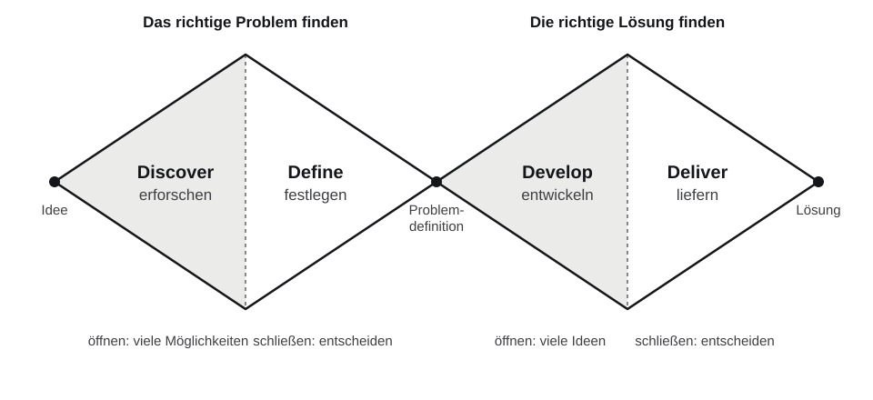

# UX und UI {#sec-ux-ui}

Zwei Abkürzungen, die oft im selben Atemzug genannt werden und doch Verschiedenes meinen. In diesem Kapitel klären wir die Begriffe, schauen uns an, warum Produkte vom Menschen aus gedacht werden sollen, und lernen den Prozess kennen, dem der Rest des Buches folgt.

## User Experience

::: {.merke}
**User Experience (UX)** ist alles, was eine Person bei der Benutzung eines Produkts erlebt: Gedanken, Gefühle, Erwartungen und die Zufriedenheit danach. Die Norm ISO 9241-210 definiert UX als die *Wahrnehmungen und Reaktionen einer Person, die aus der tatsächlichen oder erwarteten Benutzung eines Produkts, Systems oder einer Dienstleistung resultieren.*
:::

Wichtig sind zwei Details dieser Definition:

- **Erwartete Benutzung** zählt mit. UX beginnt, bevor jemand die App öffnet: bei der Werbung, beim Download, beim ersten Blick auf das Tablet am Tisch.
- UX endet nicht mit der Benutzung. Wer nach dem Essen denkt „Das ging angenehm schnell“, hat eine gute Erfahrung gemacht, auch wenn er die App längst weggelegt hat.

Typische UX-Fragen sind:

- Wie einfach ist es, einen Flug auf einer Website zu buchen?
- Finde ich die Informationen, die ich suche, schnell?
- Fühle ich mich sicher, wenn ich meine Kreditkartendaten eingebe?

## User Interface

::: {.merke}
**User Interface (UI)** ist die sichtbare und bedienbare Oberfläche eines Produkts: Layout, Buttons, Formulare, Farben, Schriften, Symbole, Animationen.
:::

Typische UI-Fragen sind:

- Wie sieht der „Buchen“-Button aus, und wo steht er?
- Welche Schriftart wird verwendet, und wie groß ist sie?
- Ist das Layout klar strukturiert?

## Usability

Zwischen UX und UI liegt ein dritter Begriff, der in Prüfungen gern gefragt wird.

::: {.merke}
**Usability (Gebrauchstauglichkeit)** ist nach ISO 9241-11 das Ausmaß, in dem ein Produkt durch bestimmte Benutzer in einem bestimmten Nutzungskontext genutzt werden kann, um bestimmte Ziele **effektiv**, **effizient** und **zufriedenstellend** zu erreichen.

- **Effektiv:** Das Ziel wird überhaupt und vollständig erreicht.
- **Effizient:** Der Aufwand (Zeit, Klicks, Denkarbeit) steht in einem vernünftigen Verhältnis zum Ergebnis.
- **Zufriedenstellend:** Die Benutzung ist frei von Beeinträchtigungen und wird positiv erlebt.
:::

Die Definition enthält drei Einschränkungen, die man leicht überliest: *bestimmte* Benutzer, *bestimmter* Nutzungskontext, *bestimmte* Ziele. Usability ist also keine Eigenschaft eines Produkts an sich. Eine App kann für Jugendliche auf dem Sofa gut benutzbar sein und für einen Koch mit nassen Händen in einer lauten Küche völlig unbrauchbar.

## Der Unterschied

| | UX | UI |
| --- | --- | --- |
| Frage | Funktioniert es, ist es angenehm? | Wie sieht es aus, wie bediene ich es? |
| Gegenstand | das gesamte Erlebnis | die sichtbare Oberfläche |
| Ergebnisse | Personas, Journey Maps, Sitemaps, Testberichte | Layouts, Farbschema, Komponenten, Icons |
| Wird gemessen mit | Interviews, Usability-Tests, Zufriedenheit | Styleguide-Prüfung, Kontrastmessung, Konsistenz |

UX und UI greifen ineinander. Ohne gute UI gibt es keine gute UX: Ein durchdachter Ablauf nützt nichts, wenn der Button unsichtbar ist. Umgekehrt bringt die schönste UI nichts ohne UX-Konzept: Eine elegant gestaltete App, die das falsche Problem löst, wird nicht benutzt.

> „Good design is actually a lot harder to notice than poor design, in part because good designs fit our needs so well that the design is invisible.“
> — Don Norman, *The Design of Everyday Things*

## Nutzerzentriertes Design

Produkte dürfen nicht dem persönlichen Geschmack von Designerinnen, Entwicklern oder der Chefin folgen. Entscheidend sind die Bedürfnisse der Menschen, die das Produkt benutzen. Das klingt selbstverständlich, ist es in der Praxis aber nicht: Entwicklerinnen und Entwickler wissen zu viel über ihr eigenes System. Was für sie offensichtlich ist, ist es für eine Person, die das System zum ersten Mal sieht, oft nicht.

::: {.merke}
**Nutzerzentriertes Design** (User-Centered Design, UCD; in der Norm *menschzentrierte Gestaltung*) stellt die Nutzenden, ihre Ziele und ihren Nutzungskontext in den Mittelpunkt jeder Entscheidung. Die Nutzenden werden während der ganzen Entwicklung einbezogen, und Entwürfe werden mit ihnen überprüft.
:::

Nutzerzentriert zu arbeiten heißt zuerst **verstehen**:

- Wer sind die Nutzenden?
- Welche Ziele haben sie?
- Welche Probleme haben sie heute?
- In welcher Umgebung benutzen sie das Produkt?

Und dann **anpassen**: Funktionen, Sprache, Layout und Zugänglichkeit richten sich nach diesen Antworten.

### Die Grundsätze nach ISO 9241-210

Die Norm ISO 9241-210 beschreibt sechs Grundsätze menschzentrierter Gestaltung:

1. Die Gestaltung beruht auf einem umfassenden Verständnis der Benutzer, ihrer Aufgaben und ihrer Umgebung.
2. Die Benutzer sind während der Gestaltung und Entwicklung einbezogen.
3. Die Gestaltung wird durch benutzerzentrierte Evaluierung bestimmt und verfeinert.
4. Der Prozess ist iterativ.
5. Die Gestaltung befasst sich mit der gesamten User Experience.
6. Im Gestaltungsteam sind fachübergreifende Kenntnisse und Sichtweisen vertreten.

### Warum sich das lohnt

- **Höhere Zufriedenheit:** Nutzende kommen wieder und empfehlen das Produkt weiter.
- **Weniger Frust und Fehler:** Das senkt den Aufwand für Support und Schulungen.
- **Geringere Kosten:** Ein Fehler, der auf Papier gefunden wird, kostet einen Radiergummi. Derselbe Fehler nach dem Release kostet Programmierung, Tests, ein Update und verärgerte Kundschaft. Als Faustregel gilt: Je später ein Problem gefunden wird, desto teurer wird es, oft um ein Vielfaches.
- **Wettbewerbsvorteil:** Wenn zwei Produkte dasselbe können, setzt sich das benutzerfreundlichere durch.

Bekannte Beispiele sind Airbnb (das Unternehmen hat seinen Durchbruch auf bessere Fotos und eine vertrauenswürdige Buchungserfahrung zurückgeführt), Spotify (Musik finden statt verwalten) und der Thermomix (Kochen Schritt für Schritt, ohne Rezeptbuch).

## Der UX-Prozess

UX-Design ist kein einmaliger Ablauf, sondern ein **Kreislauf**, der mehrmals durchlaufen wird.

```{mermaid}
%%| fig-cap: "Der UX-Prozess als Kreislauf"
flowchart LR
    R["Research<br/>verstehen"] --> D["Design<br/>entwerfen"]
    D --> T["Testing<br/>prüfen"]
    T --> I["Iteration<br/>verbessern"]
    I --> R
```

**Research:** Nutzerforschung mit Interviews, Beobachtungen, Umfragen und Datenanalyse. Ziel ist es, Bedürfnisse, Probleme und Nutzungskontexte zu erkennen. → [User Research](04-user-research.qmd), [Personas](05-personas.qmd), [User Journey](06-user-journey.qmd)

**Design:** Zuerst die Struktur (Informationsarchitektur), dann Wireframes und Prototypen: erst Low-Fidelity auf Papier, dann High-Fidelity als farbige, klickbare Prototypen in Figma. → [Informationsarchitektur](08-informationsarchitektur.qmd), [Wireframes](09-wireframes-prototypen.qmd), [Visuelle Gestaltung](10-visuelle-gestaltung.qmd)

**Testing:** Echte Nutzende probieren den Entwurf aus. Finden sie, was sie suchen? Ist der Ablauf logisch? Methoden sind Usability-Tests und A/B-Tests. → [Usability-Tests](13-usability-tests.qmd)

**Iteration:** Aus den Testergebnissen lernen und das Design anpassen. Der Kreislauf beginnt wieder bei Research.

### Double Diamond

Ein verbreitetes Modell für denselben Prozess ist der **Double Diamond** des britischen Design Council (2005). Er besteht aus zwei Rauten, die jeweils zuerst **öffnen** (viele Möglichkeiten sammeln) und dann **schließen** (sich entscheiden):

{#fig-double-diamond}

| Phase | Was passiert | Methoden in diesem Buch |
| --- | --- | --- |
| Discover | breit erforschen, ohne schon Lösungen zu suchen | Interviews, Beobachtung, Umfragen |
| Define | Erkenntnisse verdichten, das *richtige* Problem benennen | Personas, Empathy Map, Journey Map |
| Develop | viele Lösungsideen entwickeln und ausprobieren | Card Sorting, Scribbles, Wireframes |
| Deliver | die beste Lösung testen, verfeinern, umsetzen | Prototypen, Usability-Tests |

Die erste Raute sorgt dafür, dass man **das Richtige** baut, die zweite, dass man **es richtig** baut.

### Lean UX

::: {.merke}
**Lean UX** (Jeff Gothelf, Josh Seiden) ist ein schlanker UX-Prozess für agile Teams. Er besteht aus dem Kreislauf **Denken – Machen – Prüfen** (*Think – Make – Check*), setzt auf Zusammenarbeit im ganzen Team statt auf lange Dokumente und bindet Nutzende früh ein, um Entwicklung zu beschleunigen und Verschwendung zu vermeiden.
:::

Statt monatelang Anforderungen zu sammeln, formuliert das Team **Hypothesen** („Wir glauben, dass Gäste schneller bestellen, wenn die Speisekarte nach Kategorien gegliedert ist“), baut den kleinstmöglichen Test dafür (zum Beispiel einen Papierprototyp) und prüft die Hypothese mit echten Nutzenden. Lean UX passt deshalb gut zu Scrum: Jeder Sprint kann einen Durchlauf enthalten.

## Am Bestellsystem: Wo stehen wir? {#sec-ux-ui-demo}

::: {.demo}
Für das Bestellsystem gibt es bisher nur eine grobe Projektidee. **Mit Gästen oder Küchenpersonal hat noch niemand gesprochen**, und es gibt weder Anforderungen noch Entwürfe noch Code. Im Double Diamond steht das Projekt also ganz am Anfang der ersten Raute.

Die Versuchung ist groß, jetzt sofort Funktionen aufzuschreiben und loszuprogrammieren. Dann würden aber Annahmen zu Anforderungen, die niemand überprüft hat. Zum Beispiel:

- Gäste wissen ihre Tischnummer und tippen sie ein.
- Eine flache Liste ohne Kategorien reicht als Speisekarte.
- Sobald eine Bestellung *Fertig* ist, braucht sie in der Küche niemand mehr.

In diesem Buch gehen wir den Weg in der richtigen Reihenfolge: zuerst verstehen, dann daraus User Stories und ein Product Backlog ableiten, dann gestalten und testen. Wie das in einen Scrum-Prozess passt, zeigt das nächste Kapitel.
:::

## Übung {.unnumbered}

::: {.uebung}
**Gute und schlechte UX im Alltag**

**Ziel:** UX und UI an echten Produkten unterscheiden.

**Ablauf (Paare, 20 Minuten):**

1. Jede Person wählt eine App oder Website, die sie oft benutzt und mag, und eine, über die sie sich schon geärgert hat.
2. Beschreibt für beide Produkte je eine konkrete Situation: Was wolltet ihr erreichen, was ist passiert, wie habt ihr euch gefühlt?
3. Ordnet jede Beobachtung zu: Ist das ein UX-Problem (Ablauf, Verständnis, Gefühl) oder ein UI-Problem (Aussehen, Bedienelement)? Manche sind beides.
4. Prüft das Ärgernis an den drei Kriterien der Usability: effektiv, effizient, zufriedenstellend?

**Werkzeug:** Papier oder ein gemeinsames Dokument.

**Ergebnis:** Eine Tabelle mit vier Situationen, jeweils mit Zuordnung UX/UI und Usability-Kriterium.
:::

## Selbstcheck {.unnumbered .selbstcheck}

<details><summary>Worin unterscheiden sich UX und UI? Nenne je zwei Beispiele.</summary>

UX ist das gesamte Erlebnis bei der Benutzung (Gefühle, Gedanken, Zufriedenheit), UI die sichtbare, bedienbare Oberfläche. UX-Beispiele: Wie schnell finde ich eine Information? Fühle ich mich bei der Zahlung sicher? UI-Beispiele: Farbe und Position des Buchen-Buttons, verwendete Schriftart.

</details>

<details><summary>Nenne die drei Kriterien der Usability nach ISO 9241-11 und erkläre sie.</summary>

Effektivität (das Ziel wird vollständig erreicht), Effizienz (der Aufwand steht im Verhältnis zum Ergebnis), Zufriedenstellung (die Benutzung wird positiv erlebt, ohne Beeinträchtigung). Alle drei gelten immer für bestimmte Benutzer, Ziele und einen bestimmten Nutzungskontext.

</details>

<details><summary>Warum ist der UX-Prozess ein Kreislauf und kein linearer Ablauf?</summary>

Weil jeder Test neue Erkenntnisse liefert, die wieder in Research und Design zurückfließen. Man weiß am Anfang nie alles über die Nutzenden; erst durch wiederholtes Prüfen und Verbessern nähert sich das Produkt ihren Bedürfnissen an.

</details>

<details><summary>Was ist der Unterschied zwischen den beiden Rauten des Double Diamond?</summary>

Die erste Raute (Discover, Define) klärt, welches Problem gelöst werden soll: das Richtige bauen. Die zweite (Develop, Deliver) entwickelt und prüft Lösungen für dieses Problem: es richtig bauen. Beide öffnen zuerst (viele Möglichkeiten) und schließen dann (Entscheidung).

</details>

<details><summary>Was bedeutet „Denken – Machen – Prüfen“ in Lean UX?</summary>

Das Team formuliert eine Hypothese (Denken), baut den kleinstmöglichen Test dafür, etwa einen Prototyp (Machen), und überprüft sie mit echten Nutzenden (Prüfen). Danach beginnt der Kreislauf von vorn.

</details>
