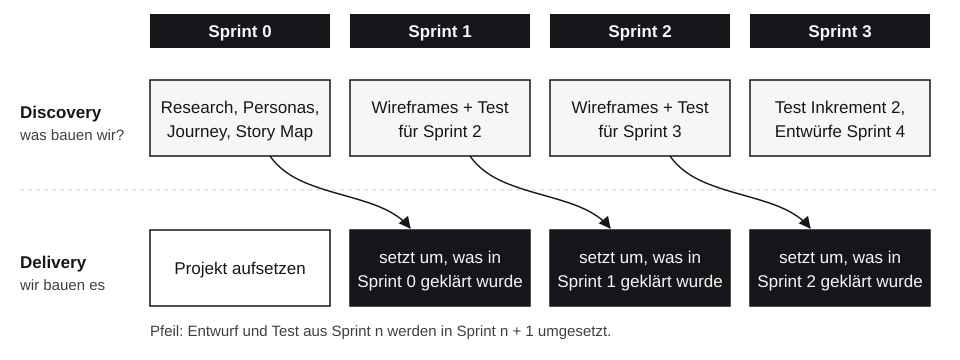

# UX im Scrum-Prozess {#sec-ux-scrum}

Scrum sagt, **wie** ein Team arbeitet: in kurzen Sprints, mit einem Product Backlog, mit regelmäßigem Feedback. Scrum sagt aber nicht, **woher** die richtigen Einträge im Backlog kommen. Ein Team kann mit Scrum sehr effizient das Falsche bauen. UX-Design füllt diese Lücke. Dieses Kapitel zeigt, wie beides zusammenpasst, und warum dieses Buch in genau dieser Reihenfolge aufgebaut ist.

## Was zuerst: User Stories oder UX-Design?

Die Frage klingt, als müsste man sich entscheiden. In der Praxis lautet die Antwort: **beides, aber in unterschiedlicher Auflösung.**

| Auflösung | Frage | Wann | Ergebnisse |
| --- | --- | --- | --- |
| **grob** | Für wen bauen wir, und welches Problem lösen wir? | **vor** dem ersten Backlog | Vision, User Research, Personas, Journey Maps |
| **mittel** | Was gehört ins Produkt, in welcher Reihenfolge? | **erzeugt** das Backlog | Story Map, User Stories, Geschäftsregeln |
| **fein** | Wie sieht diese eine Story aus, wie bedient man sie? | **einen Sprint vor** der Umsetzung | Wireframes, Prototyp, UX-Akzeptanzkriterien |
| **Prüfung** | Funktioniert, was wir gebaut haben? | **nach** jedem Inkrement | Usability-Test, neue Backlog-Einträge |

Zwei Extreme sind beide falsch:

- **Erst die User Stories, dann UX:** Die Stories beruhen auf Vermutungen. UX-Design kann danach nur noch die Oberfläche verschönern, aber nicht mehr korrigieren, *was* gebaut wird.
- **Erst das komplette UX-Design, dann Scrum:** Monatelange Forschung und ein fertiges Design für alle Bildschirme, bevor programmiert wird. Das ist ein Wasserfall mit anderem Namen (*Big Design Up Front*). Bis zur Umsetzung ist die Hälfte veraltet.

::: {.merke}
**Grobe UX vor den User Stories, feine UX knapp vor der Umsetzung.** Forschung, Personas und Journeys bestimmen, *welche* User Stories ins Backlog kommen. Wireframes und Prototypen entstehen Story für Story, etwa einen Sprint bevor die Story umgesetzt wird. Usability-Tests prüfen jedes Inkrement, und ihre Ergebnisse werden wieder zu Backlog-Einträgen.
:::

## Dual-Track Agile

Das verbreitetste Modell für dieses Zusammenspiel ist **Dual-Track Agile** (auch *Dual-Track Scrum*). Es geht auf Desirée Sy zurück, die 2007 beschrieb, wie das UX-Team bei Autodesk parallel zur Entwicklung arbeitete; bekannt gemacht haben es Jeff Patton und Marty Cagan.

::: {.merke}
**Dual-Track Agile** teilt die Arbeit eines Scrum-Teams in zwei parallele Spuren:

- **Discovery** (Entdecken): herausfinden, *was* gebaut werden soll. Forschung, Prototypen, Tests mit Nutzenden. Ergebnis sind überprüfte Backlog-Einträge.
- **Delivery** (Liefern): das Entdeckte umsetzen, in normalen Scrum-Sprints. Ergebnis ist ein funktionierendes Inkrement.

Beide Spuren laufen gleichzeitig und im selben Team. Discovery arbeitet dabei etwa einen Sprint **voraus**.
:::

{#fig-dual-track}

Wichtig: Dual-Track heißt **nicht**, dass es zwei Teams gibt, ein „Design-Team“ und ein „Entwicklungsteam“, die sich Dokumente zuwerfen. Dieselben Personen arbeiten in beiden Spuren, nur mit unterschiedlichem Zeithorizont.

## Sprint 0

Bevor das erste Inkrement entsteht, braucht ein neues Produkt eine kurze Startphase. Sie heißt oft **Sprint 0** oder *Inception*. Im Scrum Guide kommt sie nicht vor, sie ist aber in der Praxis weit verbreitet.

In Sprint 0 passiert gerade so viel Discovery, dass das Team sinnvoll starten kann:

- Vision und Ziel des Produkts klären (*Product Goal*),
- erste Nutzerforschung: einige Interviews, eine Beobachtung,
- Personas und eine Journey Map für die wichtigsten Nutzenden,
- eine **Story Map**, aus der das erste Product Backlog entsteht,
- Entwürfe für die Stories des ersten Sprints.

Sprint 0 dauert so lange wie ein normaler Sprint, also ein bis vier Wochen, nicht Monate. Was danach noch unklar ist, klärt Discovery laufend weiter.

## UX in den Scrum-Elementen

UX braucht keine eigenen Scrum-Regeln. Sie wird in die bestehenden Elemente eingebaut:

| Scrum-Element | So kommt UX hinein |
| --- | --- |
| **Product Goal** | beschreibt ein Ziel aus Sicht der Nutzenden („Gäste bestellen ohne Wartezeit“), nicht nur Funktionen |
| **Product Backlog** | enthält neben Features auch Forschungsaufgaben (*Research Spikes*), Prototyp-Tests und **UX-Schulden** (bekannte Usability-Probleme) |
| **Backlog Refinement** | Wireframes und Prototypen werden an die Story angehängt und mit dem Team besprochen; Erkenntnisse aus Tests ändern Stories |
| **Sprint Planning** | Discovery-Aufgaben für den nächsten Sprint werden mitgeplant |
| **Sprint Review** | zeigt nicht nur, was gebaut wurde, sondern auch, was man über die Nutzenden gelernt hat; im besten Fall sind echte Nutzende dabei |
| **Retrospektive** | fragt auch: Haben wir genug mit Nutzenden gesprochen? |

### Definition of Ready und Definition of Done

Zwei Vereinbarungen sorgen dafür, dass UX nicht vergessen wird:

- Die **Definition of Ready** legt fest, wann eine Story bereit für einen Sprint ist. Sie ist nicht Teil des Scrum Guide, aber in vielen Teams üblich. Eine UX-Ergänzung: *Stories mit Oberfläche haben einen Wireframe, der mit mindestens drei Nutzenden getestet wurde, und UX-Akzeptanzkriterien.*
- Die **Definition of Done** ist Teil des Scrum Guide und legt fest, wann ein Inkrement fertig ist. UX-Ergänzungen: *Kontrast und Tastaturbedienung nach WCAG AA geprüft; nur Komponenten aus dem Designsystem verwendet; Texte in der Sprache der Nutzenden.*

### Rollen

Scrum kennt drei Verantwortlichkeiten: **Product Owner**, **Scrum Master** und **Developers**. Eine eigene UX-Rolle gibt es nicht, und das ist Absicht: UX ist eine Fähigkeit im Team, keine Abteilung.

- Wer im Team UX-Kenntnisse hat (oft eine UX-Designerin oder ein UX-Designer), gehört zu den **Developers** und arbeitet vor allem in der Discovery-Spur.
- Der **Product Owner** verantwortet das Backlog und entscheidet deshalb auch, wie viel Zeit in Discovery fließt.
- Alle anderen nehmen an Interviews und Tests teil, wenigstens als Beobachtende. Wer einmal zugesehen hat, wie jemand an der eigenen Software scheitert, programmiert danach anders.

## Andere Ansätze

- **Lean UX** (siehe [UX und UI](01-ux-ui.qmd)) passt gut zu Scrum: Jede Story wird als Hypothese formuliert und im Sprint mit dem kleinstmöglichen Experiment geprüft.
- **Design Sprint** (Jake Knapp, Google Ventures): fünf Tage, in denen ein Team eine große Frage beantwortet: verstehen, skizzieren, entscheiden, Prototyp bauen, mit fünf Nutzenden testen. Gut als Sprint 0 oder vor einer großen neuen Funktion.

### Typische Fehler

- **UX nur am Anfang:** Nach Sprint 0 spricht niemand mehr mit Nutzenden.
- **UX als Abteilung:** Ein Design-Team liefert fertige Bildschirme „über den Zaun“; das Entwicklungsteam setzt um, ohne die Gründe zu kennen.
- **Design im selben Sprint:** Wenn eine Story im Sprint erst entworfen, dann getestet und dann programmiert werden soll, reicht die Zeit nicht. Deshalb arbeitet Discovery voraus.
- **Testergebnisse ohne Folgen:** Ein Usability-Test, dessen Ergebnisse nicht ins Backlog wandern, war umsonst.

## Wie dieses Buch aufgebaut ist

Die Teile des Buches folgen genau diesem Ablauf:

| Teil | Kapitel | Im Scrum-Prozess |
| --- | --- | --- |
| **Verstehen** | User Research, Personas, User Journey | Sprint 0, Discovery (grob) |
| **Planen** | Vom UX-Design zum Product Backlog | Product Goal, Story Map, User Stories und Product Backlog entstehen |
| **Gestalten** | Informationsarchitektur, Wireframes, visuelle Gestaltung, Designsysteme, Barrierefreiheit | Discovery (fein), Story für Story einen Sprint voraus |
| **Prüfen** | Usability-Tests | Test jedes Inkrements, Ergebnisse zurück ins Backlog |

Am Ende des Teils *Planen* steht ein geordnetes Product Backlog, dessen Einträge sich alle auf Forschung zurückführen lassen. Wie User Stories aus der UX-Arbeit entstehen und welchen Weg eine Story danach durch den Scrum-Ablauf nimmt, zeigt das Kapitel [Vom UX-Design zum Product Backlog](07-product-backlog.qmd) im Detail.

## Am Bestellsystem: ein Plan für die ersten Sprints {#sec-ux-scrum-demo}

::: {.demo}
**Release-Plan mit zwei Spuren** [Beispiel]{.fiktiv}, Sprintlänge zwei Wochen:

| Sprint | Discovery | Delivery |
| --- | --- | --- |
| **0** | Interviews mit Gästen und Küche, Beobachtung im Restaurant, Personas, Journeys, Story Map; Wireframes für *Speisekarte* und *Bestellen* | Projekt aufsetzen, Datenmodell |
| **1** | Card Sorting für die Speisekarte; Wireframes und Papiertest der **Küchenansicht** | Speisekarte und Bestellen (Gast) |
| **2** | Prototyp-Test *Status am Tisch*; Interview mit Servicepersonal | Küchenansicht: neue Bestellungen, Status weiterschalten |
| **3** | Usability-Test der Gast-Bestellung im echten Restaurant | Status am Tisch, Stornieren, Gericht sperren |
| **4** | Auswertung, neue Stories aus den Tests | Verbesserungen aus dem Test (UX-Schulden), Service-Ansicht |

Man sieht das Muster: Was in Sprint *n* umgesetzt wird, wurde in Sprint *n − 1* entworfen und getestet. Und was in Sprint *n* umgesetzt wurde, wird in Sprint *n + 1* mit Nutzenden geprüft.
:::

## Übung {.unnumbered}

::: {.uebung}
**Zwei Spuren planen**

**Ziel:** UX-Aufgaben in einen Scrum-Plan einbauen.

**Ablauf (Gruppen zu dritt, 30 Minuten):**

1. Nehmt ein Projekt, das ihr kennt: euer Schulprojekt oder eine App, die ihr gern bauen würdet.
2. Schreibt auf, was in Sprint 0 geklärt werden muss, bevor das Team programmieren kann. Höchstens fünf Punkte.
3. Plant drei weitere Sprints in einer Tabelle mit den Spalten *Discovery* und *Delivery*. Achtet darauf, dass Discovery einen Sprint voraus ist.
4. Formuliert je einen UX-Punkt für eure **Definition of Ready** und eure **Definition of Done**.

**Werkzeug:** Papier oder FigJam; zum Vergleich die Scrum-Unterlagen aus dem Unterricht.

**Ergebnis:** Sprint-0-Liste, Plan mit zwei Spuren, ein DoR- und ein DoD-Punkt.
:::

## Selbstcheck {.unnumbered .selbstcheck}

Kommen in Scrum zuerst die User Stories oder zuerst das UX-Design?

Beides, in unterschiedlicher Auflösung: Grobe UX (Forschung, Personas, Journeys) kommt vor den User Stories und bestimmt, welche Stories ins Backlog kommen. Feine UX (Wireframes, Prototypen) entsteht Story für Story etwa einen Sprint vor der Umsetzung. Tests prüfen jedes Inkrement.

Was ist Dual-Track Agile?

Die Arbeit eines Scrum-Teams läuft in zwei parallelen Spuren: Discovery findet heraus, was gebaut werden soll (Forschung, Prototypen, Tests), Delivery setzt es in Sprints um. Discovery arbeitet etwa einen Sprint voraus. Beide Spuren gehören zum selben Team.

Was passiert in Sprint 0?

Gerade so viel Discovery, dass das Team starten kann: Produktziel, erste Interviews, Personas, Journey Map, Story Map als Grundlage des ersten Backlogs und Entwürfe für die Stories des ersten Sprints. Sprint 0 dauert so lange wie ein normaler Sprint.

Nenne je einen UX-Punkt für eine Definition of Ready und eine Definition of Done.

DoR: Stories mit Oberfläche haben einen getesteten Wireframe und UX-Akzeptanzkriterien. DoD: Kontrast und Tastaturbedienung nach WCAG AA geprüft, nur Komponenten aus dem Designsystem verwendet.

Warum gibt es in Scrum keine eigene UX-Rolle?

Weil UX eine Fähigkeit im Team ist und keine Abteilung. Personen mit UX-Kenntnissen gehören zu den Developers; der Product Owner entscheidet über die Priorität von Discovery-Arbeit; alle anderen nehmen an Interviews und Tests teil.

Warum ist „Big Design Up Front“ in Scrum ein Fehler?

Weil ein komplett fertiges Design vor der ersten Zeile Code ein Wasserfall ist: Es dauert lange, kann nicht aus Tests am echten Produkt lernen, und bis zur Umsetzung ist vieles veraltet.

