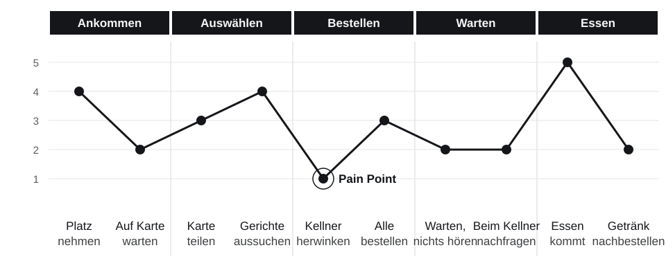

# User Journey {#sec-journey}

Eine Persona beschreibt, **wer** jemand ist. Eine User Journey beschreibt, **was** diese Person erlebt, wenn sie ein Ziel erreichen will: Schritt für Schritt, mit allen Gedanken, Gefühlen und Hindernissen auf dem Weg.

## Was ist eine User Journey?

::: {.merke}
Eine **User Journey Map** (Customer Journey Map) visualisiert den Weg, den eine Persona durchläuft, um ein bestimmtes Ziel zu erreichen. Sie zeigt für jede Phase die Handlungen, Gedanken und Gefühle der Persona, die Berührungspunkte mit dem Produkt und die **Pain Points**. Ziel ist es, Probleme im Ablauf zu erkennen und Lösungen zu entwickeln, damit der Weg reibungslos verläuft.
:::

Die Journey Map betrachtet den **ganzen** Weg, nicht nur die Momente, in denen jemand auf einen Bildschirm schaut. Beim Restaurantbesuch gehören das Hinsetzen, das Gespräch mit der Begleitung und das Warten auf das Essen genauso dazu wie das Tippen auf dem Tablet.

## Aufbau einer Journey Map

Eine Journey Map ist eine Tabelle, deren Spalten die **Phasen** und deren Zeilen die **Ebenen** sind:

| Ebene | Inhalt |
| --- | --- |
| **Persona und Szenario** | wer, mit welchem Ziel, in welcher Situation (steht über der Map) |
| **Phasen** | grobe Abschnitte des Weges, z. B. Ankommen, Auswählen, Bestellen, Warten |
| **Handlungen** | was die Persona in dieser Phase konkret tut |
| **Touchpoints** | Berührungspunkte: Tablet, Kellner, Speisekarte, Bildschirm |
| **Gedanken** | was ihr durch den Kopf geht, oft als Zitat |
| **Emotionen** | als Kurve von negativ bis positiv: Wo kippt die Stimmung? |
| **Pain Points** | Schwierigkeiten, Frustrationen, Hindernisse |
| **Chancen** (*Opportunities*) | Ideen, wie das Problem gelöst werden könnte |

Wichtige Begriffe dabei:

- **Szenario:** Die Journey beschreibt eine konkrete Situation, nicht alle denkbaren. „Lena bestellt mit fünf Freundinnen nach der Schule“ ist ein Szenario; „ein Gast bestellt“ ist zu allgemein.
- **Touchpoint:** jeder Kontakt zwischen Persona und Produkt oder Unternehmen, digital oder analog.
- **Pain Point:** eine Stelle, an der die Persona auf ein Problem stößt. Pain Points findet man dort, wo die Emotionskurve nach unten geht.
- **Moment of Truth:** eine Stelle, an der sich entscheidet, ob die Erfahrung insgesamt gut oder schlecht wird, etwa der Moment direkt nach dem Absenden der Bestellung.

### Ist-Zustand und Soll-Zustand

- Eine **Current-State Journey** beschreibt, wie es **heute** ist, beruhend auf Forschung. Sie zeigt die Probleme.
- Eine **Future-State Journey** beschreibt, wie es **sein soll**, mit dem neuen Produkt. Sie zeigt die Vision und wird später mit Tests überprüft.

## Verwandte Werkzeuge

| Werkzeug | Zeigt | Unterschied zur Journey Map |
| --- | --- | --- |
| **User Flow** | die Schritte durch die Oberfläche: Bildschirme, Entscheidungen, Klicks | nur der digitale Teil, ohne Gefühle; dient als Grundlage für Wireframes |
| **Service Blueprint** | was *hinter* den Touchpoints passiert: Mitarbeitende, Systeme, Abläufe | ergänzt die Journey um die Sicht des Unternehmens („Bühne“ und „Hinterbühne“) |
| **Story Map** | User Stories entlang der Journey, nach Priorität gestapelt | übersetzt die Journey in einen Plan für die Umsetzung |

Ein **Service Blueprint** passt besonders gut zu einem Restaurant: Die Gäste sehen die Bühne (Tisch, Tablet, Service), aber ob ihre Erfahrung gut wird, entscheidet sich oft auf der Hinterbühne (Küche, Pass, System).

## Am Bestellsystem: die Journey von Lena {#sec-journey-demo}

::: {.demo}
**Szenario:** Lena sitzt mit fünf Freundinnen nach der Schule in einem Restaurant, das noch ohne Tablets arbeitet. Sie haben eine Stunde Zeit. Current State, also wie das Bestellen **heute** abläuft, [Beispiel]{.fiktiv}.

{#fig-journey-lena}

| | Ankommen | Auswählen | Bestellen | Warten | Essen |
| --- | --- | --- | --- | --- | --- |
| **Handlungen** | sucht einen Tisch, wartet auf die Speisekarten | teilt sich zwei Speisekarten zu sechst, liest Preise vor | winkt dem Kellner, wartet; alle bestellen nacheinander, der Kellner notiert | wartet, fragt sich, ob alles richtig angekommen ist | isst, will ein Getränk nachbestellen |
| **Touchpoints** | Tisch, Kellner | Speisekarte aus Papier | Kellner, Bestellblock | Kellner (selten zu sehen) | Kellner |
| **Gedanken** | „Kommt da noch wer?“ | „Hast du schon? Gib mal her.“ | „Er hat uns gesehen, oder?“ „Hat er ‚ohne Zwiebel‘ mitgeschrieben?“ | „Haben die uns vergessen?“ | „Nochmal eine Cola, aber der Kellner schaut nie her.“ |
| **Emotion** | ungeduldig | gesellig | genervt | unsicher | zufrieden, dann wieder genervt |
| **Pain Points** | Warten, bis überhaupt jemand kommt | zu wenige Karten für die Gruppe | Kellner schwer zu erreichen; Sonderwünsche gehen verloren | keine Rückmeldung, ob und wann das Essen kommt | Nachbestellen dauert so lange wie die erste Bestellung |
| **Chancen** | Speisekarte liegt sofort am Tisch | jede Person kann die Karte selbst ansehen | selbst bestellen, in beliebiger Reihenfolge; die Bestellung kommt genau so in der Küche an | Status sichtbar machen | Getränke mit einem Tippen nachbestellen |

Diese Journey zeigt, *warum* das Restaurant überhaupt ein Tablet-System will, und sie zeigt, welche Probleme es lösen muss. Eine Future-State Journey mit dem Tablet entsteht später aus den Wireframes und wird im Usability-Test überprüft.
:::

::: {.demo}
**Die Journey von Marko (Küche)**, Future State mit einer Küchenansicht, die es noch nicht gibt, [Beispiel]{.fiktiv}.

| | Vorbereitung | Bestellung kommt | Zubereitung | Fertig | Gericht ist aus |
| --- | --- | --- | --- | --- | --- |
| **Handlungen** | schaltet den Bildschirm ein, prüft, ob alle Gerichte verfügbar sind | sieht neue Bestellung, ruft sie aus | schaltet auf *In Zubereitung*, kocht | kontrolliert den Teller, schaltet auf *Fertig* | sperrt das Gericht |
| **Touchpoints** | Küchenansicht | Küchenansicht, Signalton | Küchenansicht | Küchenansicht, Service | Küchenansicht (Gerichte) |
| **Gedanken** | „Ist das Gulasch eingetragen?“ | „Für welchen Tisch? Wie viele?“ | „Was ist als Nächstes dran?“ | „Wer holt das ab?“ | „Schnell, bevor es noch jemand bestellt.“ |
| **Emotion** | ruhig | aufmerksam | gestresst | erleichtert | gehetzt |
| **Pain Points** | – | neue Bestellung übersehen, wenn er nicht hinschaut | Nachbestellung desselben Tisches erscheint woanders | Teller wartet, Service weiß nichts davon | Gericht schwer zu finden; Bestellungen kommen in der Zwischenzeit noch herein |
| **Chancen** | Verfügbarkeit auf einen Blick | Signalton und deutliche Hervorhebung neuer Bestellungen | Bestellungen nach Tisch bündeln, Wartezeit anzeigen | *Fertig* benachrichtigt den Service | Gerichte groß und alphabetisch, Sperren mit einem Tippen |
:::

::: {.demo}
**Service Blueprint einer Bestellung** [Beispiel]{.fiktiv}

| | Bestellen | Bestätigung | Zubereitung | Servieren |
| --- | --- | --- | --- | --- |
| **Gast** (Bühne) | wählt Gerichte am Tablet | sieht Bestätigung | wartet | bekommt das Essen |
| **Service** (Bühne) | – | – | – | holt Teller am Pass, bringt ihn zum Tisch |
| *Sichtbarkeitslinie* | | | | |
| **Küche** (Hinterbühne) | – | neue Bestellung erscheint | kocht, schaltet Status weiter | stellt Teller auf den Pass, schaltet auf *Fertig* |
| **System** | prüft, ob die Gerichte verfügbar und die Mengen gültig sind | speichert Bestellung, benachrichtigt Küche | – | entfernt Bestellung aus der aktiven Ansicht |

Der Blueprint zeigt die Lücke aus der Forschung: Zwischen *Fertig* in der Küche und dem Teller auf dem Tisch gibt es einen Schritt, den das System nicht kennt. Niemand informiert den Service, und der Gast sieht *Fertig*, obwohl sein Essen noch am Pass steht.
:::

## Übung {.unnumbered}

::: {.uebung}
**Eine Journey Map erstellen**

**Ziel:** Den Weg einer eurer Personas sichtbar machen und Pain Points finden.

**Ablauf (Gruppen zu dritt, eine Unterrichtseinheit):**

1. Wählt eure primäre Persona und formuliert ein konkretes Szenario in einem Satz.
2. Legt fünf bis sieben Phasen fest, vom ersten Kontakt bis zum Ende.
3. Füllt für jede Phase Handlungen, Touchpoints, Gedanken und Emotionen aus. Stützt euch auf eure Interviews.
4. Zeichnet die Emotionskurve und markiert die zwei tiefsten Punkte als Pain Points.
5. Schreibt zu jedem Pain Point mindestens eine Chance. Formuliert aus einer davon eine neue User Story: „Als … möchte ich …, damit …“.

**Werkzeug:** großes Papier (A3) und Haftnotizen, oder FigJam mit der Vorlage „Customer Journey Map“.

**Ergebnis:** eine Journey Map mit Emotionskurve, Pain Points und Chancen; eine neue User Story.
:::

## Selbstcheck {.unnumbered .selbstcheck}

Welche Ebenen hat eine User Journey Map?

Persona und Szenario, Phasen, Handlungen, Touchpoints, Gedanken, Emotionen (als Kurve), Pain Points und Chancen.

Was ist ein Pain Point, und wie findet man ihn in einer Journey Map?

Eine Schwierigkeit, Frustration oder ein Hindernis im Ablauf. Man findet Pain Points dort, wo die Emotionskurve nach unten geht.

Worin unterscheiden sich Journey Map und User Flow?

Die Journey Map betrachtet das gesamte Erlebnis, auch außerhalb des Bildschirms, mit Gedanken und Gefühlen. Der User Flow zeigt nur die Schritte durch die Oberfläche (Bildschirme, Entscheidungen, Klicks) und dient als Grundlage für Wireframes.

Was zeigt ein Service Blueprint zusätzlich zur Journey Map?

Was hinter den Touchpoints passiert: die Arbeit der Mitarbeitenden, Systeme und Abläufe auf der „Hinterbühne“, getrennt durch die Sichtbarkeitslinie von dem, was die Kundschaft sieht.

Was ist der Unterschied zwischen Current-State und Future-State Journey?

Die Current-State Journey zeigt den heutigen Zustand auf Basis von Forschung und macht Probleme sichtbar. Die Future-State Journey zeigt, wie die Erfahrung mit dem neuen Produkt sein soll.

