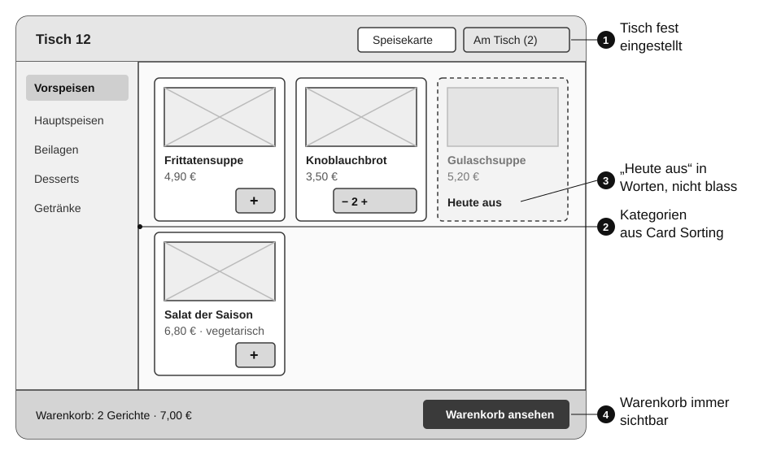
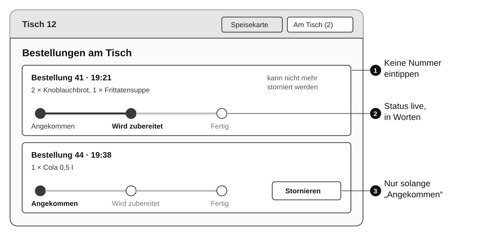
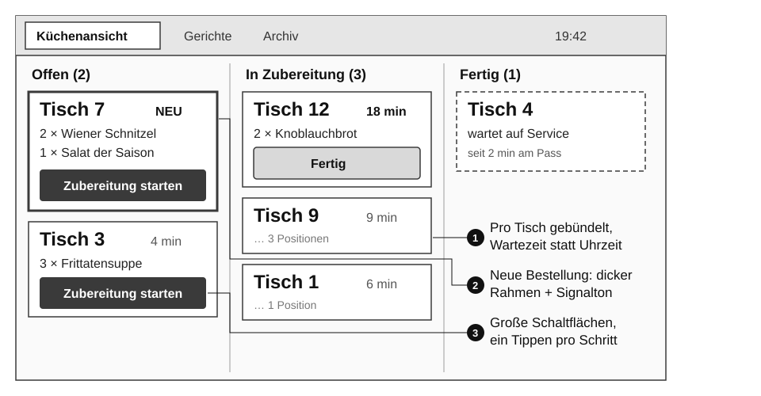

# Wireframes und Prototypen {#sec-wireframes}

Jetzt wird zum ersten Mal gezeichnet. Aber nicht schön, sondern schnell. Wireframes zeigen, **was** auf einem Bildschirm steht und **wo**, ohne sich um Farben oder Schriften zu kümmern. Prototypen machen diese Entwürfe bedienbar, damit man sie testen kann, bevor eine Zeile Code geschrieben ist.

## User Flow

Bevor man einzelne Bildschirme zeichnet, legt man fest, welche Bildschirme es für eine Aufgabe braucht und in welcher Reihenfolge.

::: {.merke}
Ein **User Flow** zeigt die Schritte, die Nutzende in der Oberfläche durchlaufen, um eine Aufgabe zu erledigen: Bildschirme, Aktionen und Entscheidungen, als Flussdiagramm.
:::

Ein User Flow beginnt immer mit einem **Einstiegspunkt** und endet mit dem **erreichten Ziel**. Dazwischen stehen Bildschirme (Rechtecke), Entscheidungen (Rauten) und Aktionen (Pfeile mit Beschriftung). Wichtig sind auch die Wege, die schiefgehen: Was passiert, wenn ein Gericht in der Zwischenzeit ausverkauft ist?

## Wireframes

::: {.merke}
Ein **Wireframe** ist eine reduzierte Layoutskizze eines Bildschirms. Er zeigt, welche Elemente es gibt (Navigation, Inhalte, Buttons, Formulare), wie sie angeordnet sind und wie der Ablauf ist, aber noch keine Details: keine Farben, keine Bilder, nur Kästen und Platzhalter.
:::

### Fidelity

*Fidelity* (Wiedergabetreue) beschreibt, wie nahe ein Entwurf am fertigen Produkt ist.

| | Low-Fidelity | Mid-Fidelity | High-Fidelity |
| --- | --- | --- | --- |
| Aussehen | Scribble mit Stift auf Papier | sauberer Wireframe in Graustufen | sieht aus wie das fertige Produkt |
| Inhalt | Platzhalter, Wellenlinien statt Text | echte Beschriftungen, Platzhalter für Bilder | echte Texte, Bilder, Farben, Schriften |
| Werkzeug | Papier, Whiteboard | Figma, Balsamiq | Figma |
| Dauer pro Bildschirm | Minuten | eine Viertelstunde | Stunden |
| Feedback auf | Struktur und Ablauf | Anordnung und Beschriftung | Gestaltung und Details |

### Grundelemente für Scribbles

Für Scribbles braucht man nur vier Zeichen:

- **Rechtecke** für Bereiche und Container,
- **Linien** (oder Wellenlinien) für Text,
- **Kreuze in Rechtecken** für Bildplatzhalter,
- **Pfeile** für den Nutzerfluss: was passiert, wenn man hier tippt.

### Warum zuerst auf Papier?

- **Schnell:** Ein Bildschirm in zwei Minuten. In derselben Zeit hat man in Figma gerade das Raster eingerichtet.
- **Einfach:** Jede Person kann mit Stift und Papier mitmachen, auch ohne Erfahrung mit Design-Werkzeugen.
- **Flexibel:** Änderungen kosten nichts. Man zerknüllt das Blatt und zeichnet neu.
- **Fokus auf Struktur:** Niemand diskutiert über den richtigen Blauton, solange alles mit Bleistift gezeichnet ist.
- **Gut für Diskussionen im Team:** Wer etwas sichtbar gemacht hat, wird verstanden. Man investiert erst in ein Werkzeug, wenn die Struktur steht.

Eine bewährte Übung ist **Crazy 8s** aus dem Design Sprint: Ein A4-Blatt wird zweimal gefaltet, sodass acht Felder entstehen, und jede Person zeichnet in acht Minuten acht verschiedene Varianten desselben Bildschirms, eine pro Minute. Die erste Idee ist selten die beste; die fünfte ist oft überraschend gut.

### Wireframes beschriften

Ein Wireframe allein erklärt nicht alles. **Anmerkungen** (*Annotations*) halten fest, was man nicht sieht: Was passiert bei einem Fehler? Woher kommen die Daten? Warum steht etwas genau hier? Anmerkungen werden nummeriert und mit einer Linie mit dem Element verbunden, auf das sie sich beziehen.

## Prototypen

::: {.merke}
Ein **Prototyp** ist eine bedienbare Simulation eines Produkts, meist eine klickbare Version von Wireframes oder Gestaltungsentwürfen. Er dient dazu, Abläufe mit Nutzenden zu testen, bevor programmiert wird.
:::

| Art | Beschreibung | Gut für |
| --- | --- | --- |
| **Papierprototyp** | Bildschirme auf Papier; eine Person spielt „den Computer“ und legt bei jedem Tippen das nächste Blatt hin | allererste Tests, schon nach einer Stunde Arbeit |
| **Klickbarer Wireframe** | Wireframes in Figma, durch Verbindungen zwischen Frames klickbar | Ablauf und Navigation testen |
| **High-Fidelity-Prototyp** | gestaltete Bildschirme mit Interaktionen und Animationen | Details, Verständlichkeit von Texten und Symbolen, Präsentation |
| **Code-Prototyp** | schnell programmierte, nicht fertige Anwendung | echte Daten, Performance, komplexe Interaktion |

Wichtig: Ein Prototyp ist ein **Wegwerfprodukt**. Er soll eine Frage beantworten, nicht für immer halten. Wer zu viel Zeit in einen Prototyp steckt, verteidigt ihn später gegen die Testergebnisse.

### Wireframe, Mockup, Prototyp

Diese drei Begriffe werden oft verwechselt:

- **Wireframe:** Struktur, ohne Gestaltung, nicht bedienbar.
- **Mockup:** statisches Bild, wie der Bildschirm fertig aussehen soll, mit Farben und Schriften.
- **Prototyp:** bedienbar, egal ob grob oder detailliert.

## Mit Figma arbeiten

Figma ist das verbreitetste Werkzeug für Wireframes, Gestaltung und Prototypen. Es läuft im Browser, mehrere Personen können gleichzeitig in derselben Datei arbeiten, und mit einem Education-Konto ist es für Schülerinnen und Schüler kostenlos.

Die wichtigsten Begriffe:

| Begriff | Bedeutung |
| --- | --- |
| **Frame** | ein Bildschirm oder Bereich, z. B. in der Größe eines Tablets; Figma bietet Vorlagen für gängige Geräte |
| **Auto Layout** | Elemente in einem Frame ordnen sich automatisch untereinander oder nebeneinander an, mit festen Abständen; ändert sich ein Text, rückt alles nach |
| **Component** | ein wiederverwendbares Element, z. B. eine Gericht-Karte; Änderungen an der Hauptkomponente wirken auf alle Kopien |
| **Variant** | Ausprägungen einer Komponente, z. B. Karte *verfügbar* und *ausverkauft* |
| **Prototype-Modus** | Verbindungen zwischen Frames ziehen: „bei Klick auf diesen Button → zeige jenen Frame“ |
| **Present** | den Prototyp abspielen, am Rechner oder per Link am Tablet |

Ein guter Arbeitsablauf in Figma:

1. Für jeden Bildschirm im User Flow einen Frame in Tablet-Größe anlegen.
2. Mit Rechtecken und Text den Wireframe nachbauen; Graustufen, eine Schrift.
3. Wiederkehrende Elemente (Gericht-Karte, Button, Kopfzeile) sofort als Component anlegen.
4. Im Prototype-Modus die Frames entlang des User Flows verbinden.
5. Mit *Present* durchklicken, dann den Link für den Usability-Test teilen.

## Am Bestellsystem: vom Flow zum Prototyp {#sec-wireframes-demo}

::: {.demo}
**User Flow „Gast bestellt“** auf Basis der neuen Sitemap aus dem letzten Kapitel:

```{mermaid}
%%| fig-cap: "User Flow: Ein Gast bestellt am Tablet"
flowchart TD
    A(["Gast nimmt das Tablet"]) --> B["Speisekarte<br/>Kategorie wählen"]
    B --> C{"Gericht verfügbar?"}
    C -- ja --> D["Gericht hinzufügen<br/>Menge anpassen"]
    C -- "nein: 'Heute aus'" --> B
    D --> E{"Noch etwas?"}
    E -- ja --> B
    E -- nein --> F["Warenkorb prüfen"]
    F --> G["Bestellung abschicken"]
    G --> H{"Inzwischen ausverkauft?"}
    H -- nein --> I["Bestätigung<br/>'Die Küche hat deine Bestellung'"]
    H -- ja --> J["Hinweis: Gericht entfernen<br/>oder ersetzen"]
    J --> F
    I --> K(["Bestellungen am Tisch<br/>Status live"])
```

Der Pfad über *„Inzwischen ausverkauft?“* ist das dritte Akzeptanzkriterium von US-002 (BR-001). Es stammt aus der Journey von Marko: Zwischen dem Auswählen und dem Abschicken kann die Küche ein Gericht sperren. Im Flow sieht man, an welcher Stelle der Gast davon erfährt und wie er weitermacht.
:::

::: {.demo}
**Wireframes.** Die Scribbles der Gruppe wurden als Mid-Fidelity-Wireframes nachgezeichnet. Die Nummern verweisen auf Anmerkungen, die aus Forschung, Personas und Card Sorting stammen.

{#fig-wf-speisekarte}

{#fig-wf-status}

{#fig-wf-kueche}

Jede Gestaltungsentscheidung lässt sich auf eine Erkenntnis oder eine User Story zurückführen:

| Entscheidung | Grund |
| --- | --- |
| Tischnummer ist im Tablet eingestellt | Beobachtung: Kein Gast kennt seine Tischnummer (US-002, BR-004). |
| Speisekarte ist die Startseite, mit Kategorien | Journey Lena: Warten auf die Karte ist ein Pain Point; Card Sorting: Gäste erwarten Gruppen. |
| „Heute aus“ als Text statt nur blasser Karte | Persona Herbert: blasse Darstellung ist schwer erkennbar (US-001). |
| Status aller Bestellungen am Tisch, live, ohne Nummer | Journey Lena: Unsicherheit beim Warten (US-003). |
| Stornieren nur sichtbar, solange möglich | BR-006: Ein Button, der nicht funktioniert, frustriert. |
| Küchenansicht nach Tisch, mit Wartezeit, große Schaltflächen | Persona und Journey Marko: Überblick aus der Entfernung, keine Hand frei (US-006, US-007). |
| Spalte *Fertig* zeigt „wartet auf Service“ | Service Blueprint: Lücke zwischen Küche und Tisch. |

Im Backlog werden die Wireframes an die jeweilige Story gehängt. Getestet als Papier- oder Figma-Prototyp, erfüllen sie den UX-Punkt der Definition of Ready.
:::

## Übung {.unnumbered}

::: {.uebung}
**Vom Scribble zum klickbaren Prototyp**

**Ziel:** Den Bestellablauf für das Gast-Tablet als Prototyp bauen, der im nächsten Schritt getestet werden kann.

**Ablauf (Gruppen zu dritt, zwei Unterrichtseinheiten):**

1. Zeichnet den User Flow „Gast bestellt“ für eure Sitemap auf Papier, inklusive mindestens eines Fehlerfalls.
2. **Crazy 8s:** Jede Person faltet ein A4-Blatt in acht Felder und zeichnet in acht Minuten acht Varianten der Speisekarte.
3. Stellt eure Varianten vor und wählt pro Bildschirm die besten Ideen. Ihr dürft Teile verschiedener Varianten kombinieren.
4. Zeichnet die Bildschirme des Flows als saubere Scribbles und testet sie sofort als Papierprototyp mit einer Person aus einer anderen Gruppe.
5. Baut die Bildschirme in Figma als Wireframes in Graustufen nach. Legt die Gericht-Karte als Component mit den Varianten *verfügbar* und *ausverkauft* an.
6. Verbindet die Frames im Prototype-Modus, sodass der ganze Flow durchklickbar ist.

**Werkzeug:** Papier und Stift; Figma (Education-Konto).

**Ergebnis:** Fotos der Scribbles, ein Figma-Link zum klickbaren Prototyp, eine Liste mit drei Änderungen, die der Papiertest ausgelöst hat.
:::

## Selbstcheck {.unnumbered .selbstcheck}

<details><summary>Was ist ein Wireframe, und was zeigt er bewusst nicht?</summary>

Eine reduzierte Layoutskizze, die Elemente, ihre Anordnung und den Ablauf zeigt. Bewusst nicht: Farben, Bilder, Schriften und andere gestalterische Details.

</details>

<details><summary>Nenne die vier Grundelemente für Scribbles.</summary>

Rechtecke für Bereiche, Linien für Text, Kreuze in Rechtecken für Bildplatzhalter, Pfeile für den Nutzerfluss.

</details>

<details><summary>Warum beginnt man mit Low-Fidelity-Entwürfen auf Papier?</summary>

Weil sie schnell und einfach sind, Änderungen nichts kosten, jede Person mitmachen kann und die Diskussion bei der Struktur bleibt statt bei Farben und Details.

</details>

<details><summary>Was ist der Unterschied zwischen Wireframe, Mockup und Prototyp?</summary>

Wireframe: Struktur ohne Gestaltung, nicht bedienbar. Mockup: statisches, gestaltetes Bild des fertigen Bildschirms. Prototyp: bedienbare Simulation, grob oder detailliert.

</details>

<details><summary>Was ist ein Component in Figma, und welchen Vorteil hat es?</summary>

Ein wiederverwendbares Element. Änderungen an der Hauptkomponente werden automatisch auf alle Kopien übertragen, was Zeit spart und für Konsistenz sorgt.

</details>
